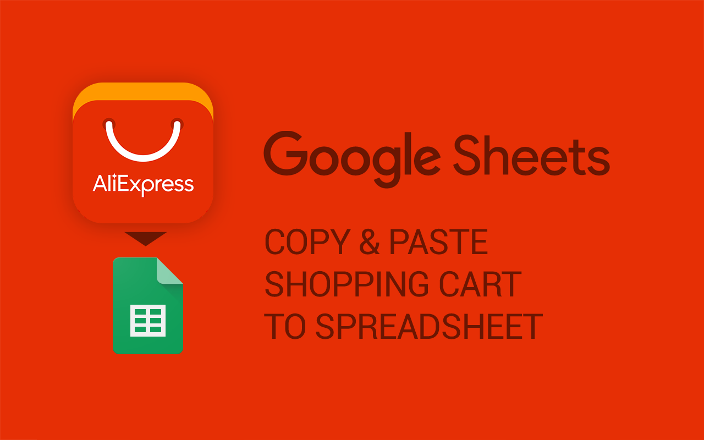
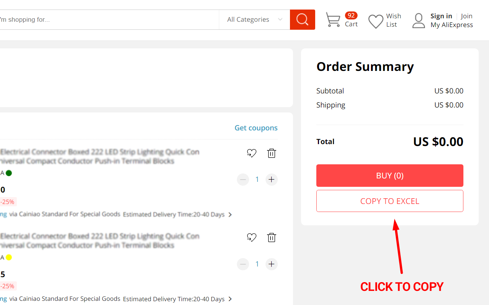
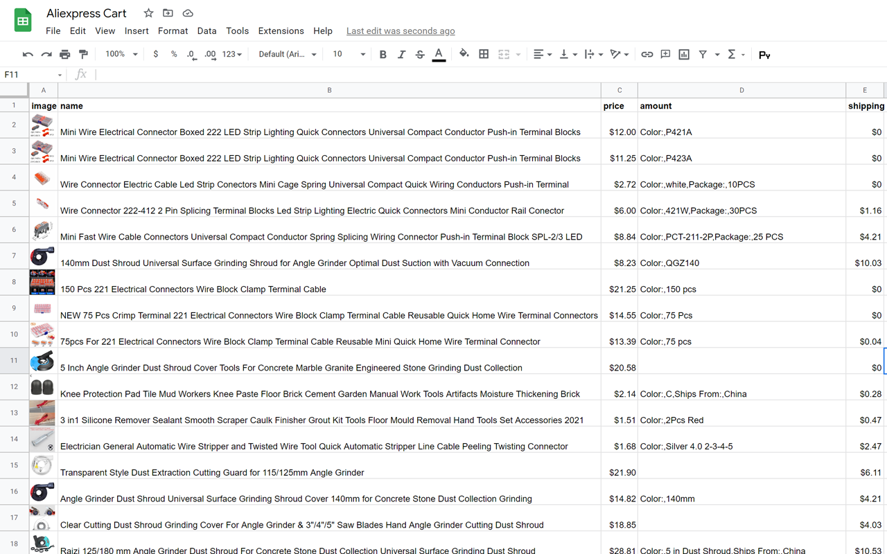

#  AliExpress Shopping Cart to Google Spreadsheet - Chrome Extension manifest 3 version

Convert your Aliexpress shopping cart to easy readable and sortable Google Spread Sheet for further comparison of prices, and shipping cost.

### How to Use
- Step 1: Install Extension
- Step 2: Go to Aliexpress Shopping Cart
- Step 3: Alert will show how many items copied to Clipboard, Alternatively there will be button below BUY, named "COPY TO EXCEL" if you scroll down to load more items and press the button it will Alert how many items copied to clipboard
- Step 4: Open Google Spread Sheet, and paste to new sheet, after you could sort and filter by colums ( Name, Price, Amount and Shipping cost )

### Notice: 
1. Free shipping replaced to $ 0
2. USD $ XX.00, replaced to $ XX,

